<div align="center">


# GoWorks

**Open-source desktop app for Google Workspace™ administration — bulk user lifecycle management, offboarding, Gmail signature deployment, and group management.**

[](LICENSE)
[]()
[]()
[]()
[]()

**English** · [Türkçe](README.tr.md)

</div>

---

**GoWorks** is a cross-platform desktop application that gives Google Workspace administrators a fast, focused UI for the day-to-day work that the Google Admin Console makes slow: onboarding and offboarding employees, bulk-suspending or deleting accounts from a CSV, deploying standardized Gmail signatures across the organization, managing groups, and auditing user activity.

It runs **entirely on your machine** — a local SQLite database and an in-process job queue. There is no server to host, no Docker, no external database. You connect it to your own Google Cloud project, and your data never leaves your computer.

## Table of Contents

- [Features](#features)
- [Why GoWorks](#why-goworks)
- [Screenshots](#screenshots)
- [Tech Stack](#tech-stack)
- [Getting Started](#getting-started)
- [Building Installers](#building-installers)
- [Changelog](#changelog)
- [Architecture](#architecture)
- [OAuth Scopes](#oauth-scopes)
- [Security & Privacy](#security--privacy)
- [Contributing](#contributing)
- [License](#license)
- [Disclaimer](#disclaimer)
- [AI-Assisted Development](#ai-assisted-development)

## Features

- **🔐 Secure Google OAuth2 sign-in** — loopback OAuth flow with domain and admin-role verification. Only Workspace admins from your configured domain can sign in.
- **🔒 Master-password vault** — sensitive secrets (the Service Account key and the Google session/refresh token) are encrypted at rest with Argon2id + AES-256-GCM and unlocked by a master password you set during onboarding. Configurable idle auto-lock, in-app password change (no re-upload or re-login), graceful lock that lets running jobs finish, and brute-force lockout with exponential back-off.
- **👥 User management** — search, view, and edit user profiles and group memberships; suspend, delete, and restore accounts; manage aliases and email forwarding.
- **📦 Bulk operations** — drive suspend / delete / signature-push / group-add jobs from a CSV file, with a guided wizard, cancellable jobs, rate limiting, automatic retry on transient errors, and live progress.
- **🚪 Offboarding wizard** — a guided multi-step flow to safely deprovision a departing employee: suspend, set email forwarding, remove from groups, and more.
- **🧭 Onboarding wizard** — first-run setup that walks you through terms acceptance, company branding, the Google Cloud project, the Service Account, and Domain-Wide Delegation.
- **🧹 Factory reset** — securely wipe all data (branding, OAuth credentials, Service Account, signatures, history) behind a type-to-confirm guard: the vault file is overwritten before deletion and the database free pages / WAL are reclaimed, so nothing sensitive is left behind. A lighter wizard restart that preserves your configuration is also available.
- **✍️ Gmail signature management** — a WYSIWYG HTML template editor with reusable tokens, a formatting toolbar, starter templates, direct image upload with auto media tokens (`{{image_N}}`), and background signature deployment across the domain via a Service Account.
- **🔎 Signature audit** — scan the organization for signature drift, then review and apply fixes.
- **👨‍👩‍👧 Google Groups management** — full CRUD for groups, members, roles, aliases, and access settings (Directory API + Groups Settings API), plus bulk member import from a CSV file.
- **📊 Dashboard & reports** — active job tracking, Google Admin audit log, and Workspace storage/usage reports.
- **🗂️ Persistent local store** — templates, job titles, institutions, app config, and full job history in a local SQLite database, with crash-safe job resumption.
- **🎨 Dynamic branding** — company name, sidebar abbreviation, logo, email sender name, and allowed login domain are all configurable in-app. GoWorks is **not tied to any single organization** — re-branding is a settings change.
- **⚖️ Terms & disclaimer** — a versioned, locale-aware terms-of-use and liability-disclaimer acceptance gate shown during onboarding and re-prompted when the terms change; also viewable from Settings → About.
- **🌍 Bilingual UI** — full English and Turkish interface, switchable at runtime.

## Why GoWorks

The Google Admin Console is powerful but slow for repetitive lifecycle work — there is no good bulk CSV workflow, no signature templating, and offboarding is a manual checklist. GoWorks is built for IT admins and Workspace operators who do these tasks every week:

- **No infrastructure** — download, connect your Google Cloud project, done. No server, no database setup.
- **Bring your own credentials** — you create the OAuth client in *your* Google Cloud project. Your tokens and data stay local.
- **Multi-tenant by design** — nothing about any customer is hardcoded; one build works for any organization.
- **Open source** — Apache 2.0 licensed. Audit it, fork it, adapt it.

## Screenshots

> Captured in the built-in demo mode against a fictional tenant (**ACME Inc.**) — no real
> customer data. See [`docs/DEMO_MODE.md`](docs/DEMO_MODE.md).

| | |
|---|---|
| 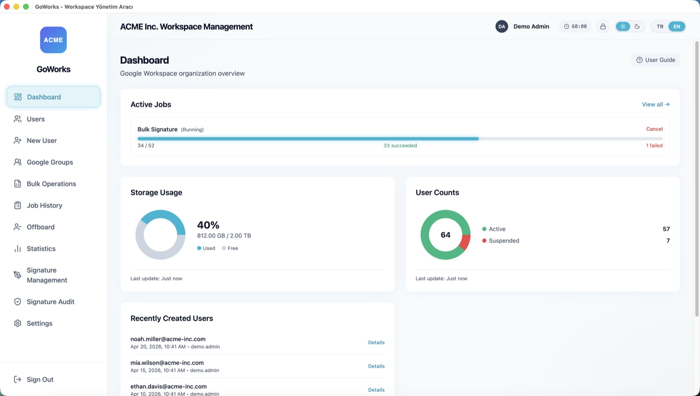 | 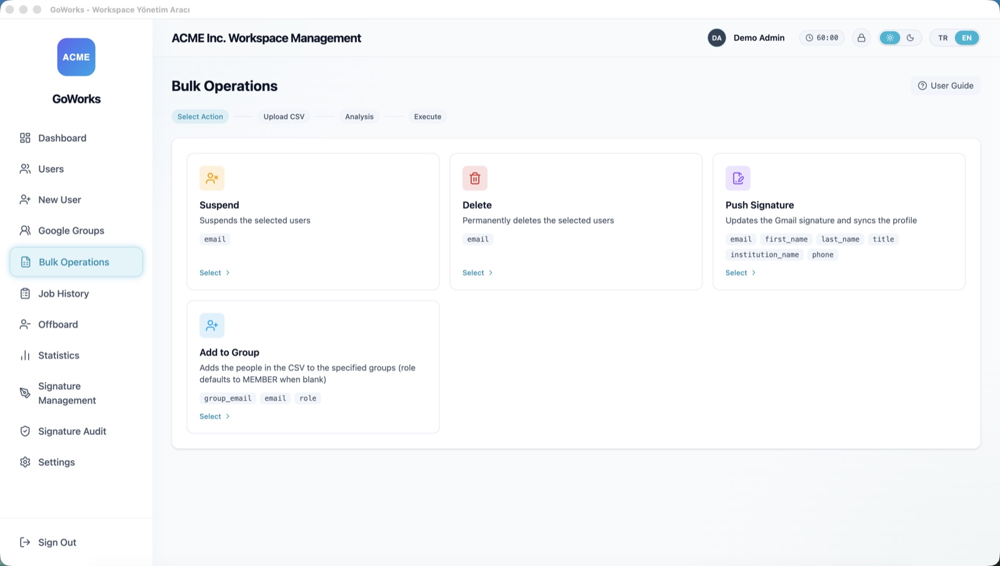 |
| **Dashboard** — storage usage, user counts, and a bulk job reporting live progress | **Bulk Operations** — a CSV drives suspend, delete, signature push, or group add |
| 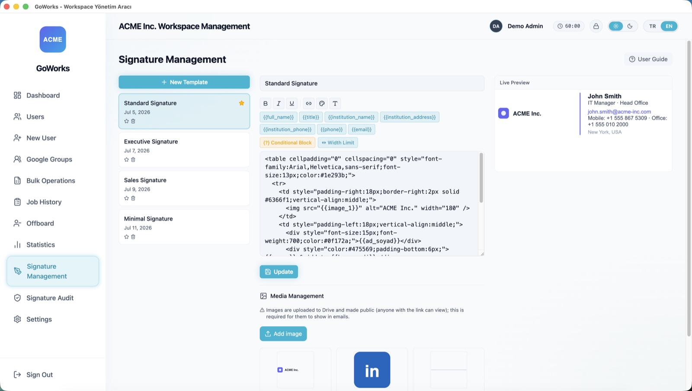 | 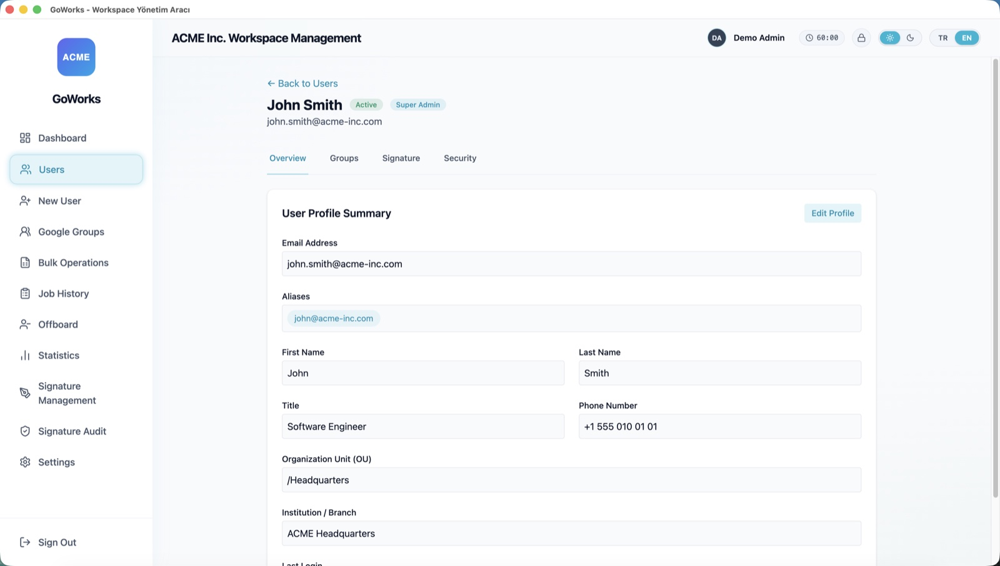 |
| **Gmail signature editor** — reusable tokens, a formatting toolbar, live preview, and an image library | **User detail** — profile, aliases, org unit, and last login |
| 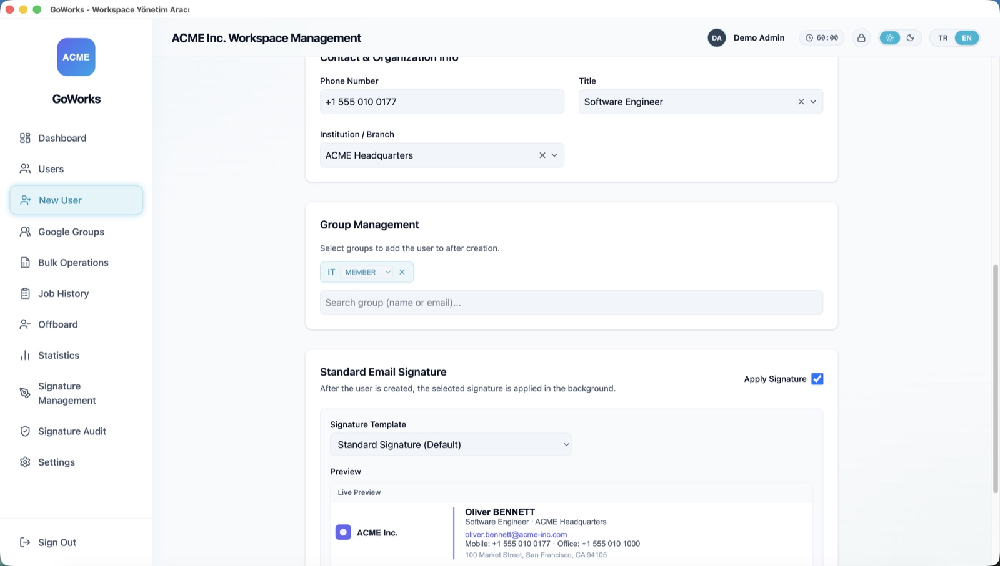 | 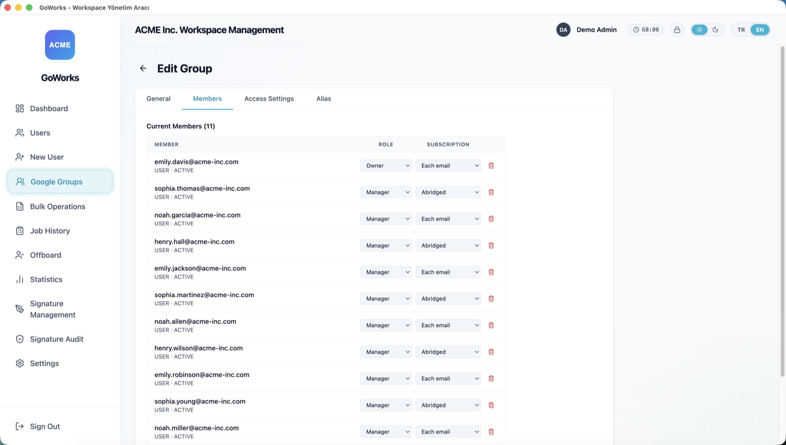 |
| **New user** — assign groups and a Gmail signature as the account is created | **Group edit** — members with per-member role and subscription, plus access settings and aliases |
| 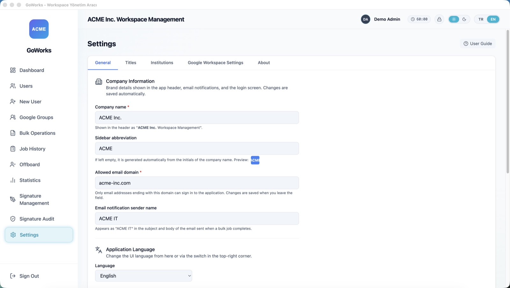 | 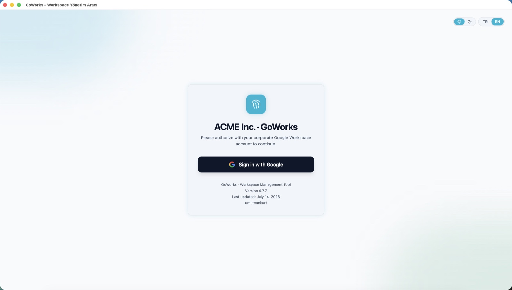 |
| **Settings** — company name, logo, allowed domain, and language, all configurable in-app | **Login** — Google sign-in, restricted to admins on your configured domain |

<details>
<summary><b>More screens</b> — setup wizard, vault lock, signature push</summary>
<br>

**Onboarding wizard** — nine guided steps, from terms acceptance through the Google Cloud project, the Service Account, and Domain-Wide Delegation.

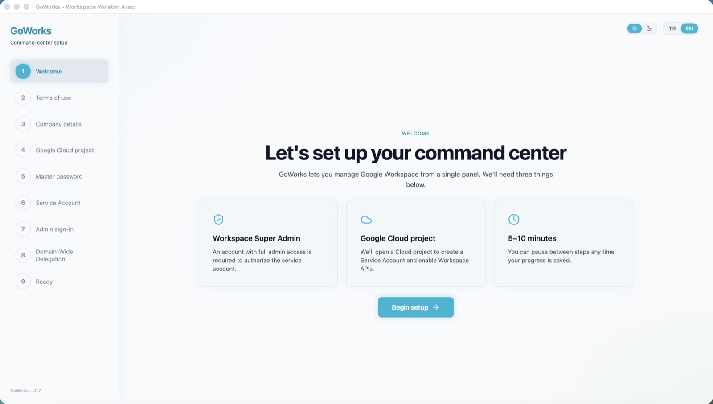
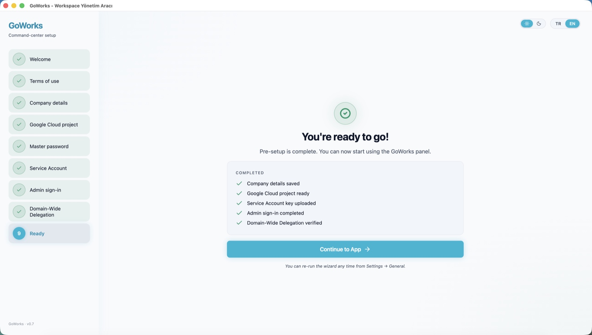

**Master-password vault** — an idle timeout locks the app; unlocking restores the Google session without a re-login.

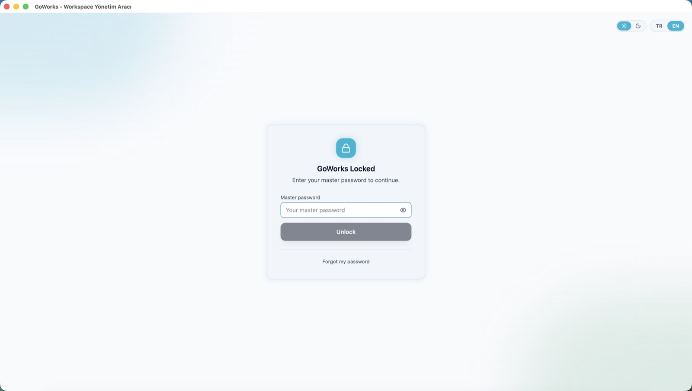

**Signature push** — apply a template to a single user's Gmail signature.

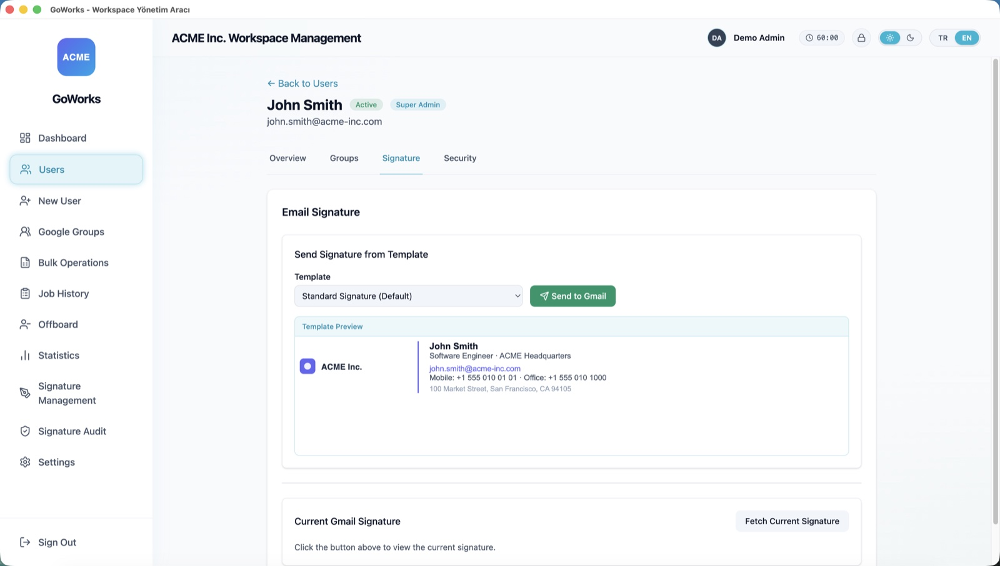

</details>

## Tech Stack

| Layer | Technology |
|---|---|
| Desktop shell | Electron 40 |
| UI | React 18, Vite 5, TailwindCSS 4, Framer Motion, Lucide |
| Language | TypeScript (strict) |
| Local data | better-sqlite3 (SQLite), in-process job queue |
| Google APIs | googleapis, google-auth-library (OAuth2 + Service Account / DWD) |
| Reliability | Bottleneck (rate limiting), exponential-backoff retry |
| i18n | i18next, react-i18next |
| Testing | Vitest, Testing Library (jsdom) |

## Getting Started

### Prerequisites

- **Node.js 20+**
- A **Google Workspace** account with **super-admin** privileges
- A **Google Cloud project** you control

### 1. Set up a Google Cloud project

GoWorks does not ship with credentials — each deployment uses its own Google Cloud OAuth client. This keeps your data isolated and means you control your own API quota.

1. Create a project in the [Google Cloud Console](https://console.cloud.google.com/).
2. Enable these APIs: **Admin SDK API**, **Gmail API**, **Groups Settings API**, and **Google Drive API** (the last is required for uploading signature images).
3. Configure the **OAuth consent screen** — choose the **Internal** user type (recommended for a single organization; no Google verification required).
4. Create an **OAuth client ID** with application type **Desktop app**. Keep the Client ID and Secret handy — the onboarding wizard will ask for them on first launch.

   > **No `.env` required.** The OAuth Client ID/Secret are collected via the onboarding wizard's "Google Cloud project" step and stored locally in the SQLite `app_config` table as plain config. For a desktop app the client secret is a "public client" credential (RFC 8252), not a true secret — and it must be readable before the master-password vault is unlocked, in order to refresh the access token. The genuinely sensitive secrets (Service Account key and refresh token) are encrypted in the vault instead. You can rotate the OAuth values later from Settings → Genel → "Google OAuth Bilgileri".
   >
   > For local development you can still drop the values into `.env` (copy `.env.example`); on first launch they are auto-migrated to encrypted storage and the file is renamed to `.env.migrated` in production builds (kept untouched in dev).

### 2. Install and run

```bash
git clone https://github.com/umutcankurt/goworks.git
cd goworks
npm install
npm run dev
```

The onboarding wizard launches on first run and walks you through the rest.

### 3. (Optional) Service Account for Gmail features

Gmail signature deployment and job-completion emails require a **Service Account with Domain-Wide Delegation (DWD)**:

1. In your Google Cloud project, create a Service Account and generate a JSON key.
2. In the [Google Admin Console](https://admin.google.com/) → **Security → API controls → Domain-wide delegation**, authorize the Service Account's client ID for the [DWD scopes](#oauth-scopes).
3. In GoWorks, open **Settings → Service Account** and upload the JSON key. It is written encrypted into the master-password vault (`vault.enc`) and never leaves your machine. (Older installs that kept the key as a `0600` file under `…/secrets/` are migrated into the vault on first unlock and the plaintext file is removed.)

## Building Installers

```bash
npm run build
```

Produces platform installers under `release/{version}/` — macOS `.dmg` and Windows `.exe` (NSIS). There is no auto-update; distribute new versions manually.

## Troubleshooting

### `No handler registered for 'X'` (random IPC errors after building installers)

If you ran `npm run build` (which produces both `-m` and `-w` artifacts) and then went back to your dev machine, the native `better-sqlite3` binary in `node_modules/` may be compiled for the wrong platform or Electron ABI. The symptom is a random IPC error in the renderer — `config:set`, `auth:check`, `config:getAll`, etc.

Three independent defenses are in place:

1. **`npm run dev`** detects ABI mismatch via the `predev` hook and auto-rebuilds. A visible banner is printed so you know why startup is slow (~30–60s).
2. **Boot-check** — if the mismatch is somehow still present at runtime, an error dialog shows the exact remediation command before the app exits.
3. **Manual fix** — `npm run rebuild` (alias for `electron-builder install-app-deps`) at any time.

**CI / strict mode**: set `CHECK_NATIVE_ABI_STRICT=1` (or run under `CI=true`, which GitHub Actions and most CI runners set automatically) to make the predev hook fail loudly instead of auto-rebuilding.

You can also run `npm run abi:check` standalone to check the binary without invoking dev.

## Changelog

See [`CHANGELOG.md`](CHANGELOG.md) for the per-version release history.

## Architecture

GoWorks uses Electron's standard two-process split:

- **Renderer** (`src/`) — the React app. Never touches Google APIs directly.
- **Main** (`electron/`) — the Node.js process: OAuth, all Google API calls, the SQLite database, and the job queue.
- **Bridge** (`electron/preload.ts`) — a context bridge exposing safe IPC channels.

```
React (renderer) → window.electronAPI.invoke(channel) → ipcMain.handle → services → Google APIs
```

The job queue is SQLite-backed with an in-process runner: per-job-type concurrency limits, cancellation, exponential-backoff retry on `429 / 503 / ECONNRESET`, and crash-safe resumption of `RUNNING` jobs on startup.

## OAuth Scopes

**Interactive admin sign-in** (your OAuth client):

| Scope | Purpose |
|---|---|
| `userinfo.profile`, `userinfo.email` | Identify the signed-in admin |
| `admin.directory.user` | Read & manage users |
| `admin.directory.group` | Read & manage groups |
| `admin.directory.orgunit.readonly` | Read org units |
| `admin.directory.domain.readonly` | Read domains |
| `admin.reports.audit.readonly` | Admin audit log |
| `admin.reports.usage.readonly` | Storage & usage reports |
| `apps.groups.settings` | Group access settings |
| `drive.file` | Upload signature images to Drive (only files the app creates) |

**Service Account (DWD)** — only needed for Gmail features:

| Scope | Purpose |
|---|---|
| `admin.directory.user` | Resolve users for signature push |
| `admin.directory.group.readonly` | Resolve group membership |
| `admin.directory.orgunit.readonly` | Resolve org units |
| `gmail.settings.basic` | Set Gmail signatures |
| `gmail.send` | Send job-completion notification emails |

## Security & Privacy

- **Your credentials, your project** — GoWorks ships no API keys. You create the OAuth client; everything is stored locally in your OS user-data directory.
- **Admin-only** — sign-in is rejected unless the account is a Workspace admin on your configured domain.
- **Master-password vault** — the truly sensitive secrets (Service Account key and the Google refresh token) live encrypted in a master-password vault (`vault.enc`, Argon2id + AES-256-GCM) and never leave your machine. The access token stays in memory only; the OAuth Client ID/Secret are stored as plain config (a desktop app is a "public client" — the secret is not a true secret). Electron `safeStorage` is retired and read only once to migrate older installs.
- **Local-only data** — the SQLite database and all secrets stay on your machine. There is no telemetry and no GoWorks backend.
- **Data location & disposal** — everything lives under your OS user-data directory (`%APPDATA%\GoWorks` on Windows, `~/Library/Application Support/GoWorks` on macOS): `vault.enc` (the encrypted Service Account key and refresh token), `goworks.db` (branding, institutions, templates, and the plain-config OAuth client secret), and `logs/` (which may contain email addresses). When you retire a machine, dispose of this data deliberately: on **Windows** the uninstaller offers to delete it (opt-in; the default is to keep it), and on **macOS** — where there is no uninstall hook — run **Settings → Factory Reset** first. Factory Reset performs a secure wipe (overwrite-then-unlink of `vault.enc`, `VACUUM` + `wal_checkpoint(TRUNCATE)` on the database, and log removal).
- **Idle auto-lock** — after a configurable idle period (default 1 hour; set in Settings → Genel → Güvenlik, `0` = off) the vault **locks** rather than logging out: in-memory credentials are dropped but the refresh token survives in the vault, so unlocking with the master password silently restores the Google session. If the stored session can no longer be refreshed (for example the refresh token was revoked), a dedicated re-authentication screen guides you back through sign-in instead of failing silently.
- **Forgetting the master password is unrecoverable** — the only path forward is resetting the vault, which wipes the stored Service Account key and session; you then re-upload the key and sign in to Google again.
- Never commit your `.env` — it is git-ignored by default.

Found a vulnerability? Please report it privately — see [`SECURITY.md`](SECURITY.md).

## Contributing

Contributions, issues, and feature requests are welcome. See [`CONTRIBUTING.md`](CONTRIBUTING.md) for the development setup and conventions. Before opening a pull request, please make sure the local checks pass:

```bash
npm run lint      # ESLint, zero warnings
npx tsc --noEmit  # TypeScript strict
npm run test      # Vitest
```

If GoWorks is useful to you, a ⭐ on the repository helps others find it.

## License

Licensed under the [Apache License 2.0](LICENSE). You are free to use, modify, and distribute it, including commercially.

## Disclaimer

GoWorks is an independent open-source project. It is **not affiliated with, endorsed by, or sponsored by Google LLC**. "Google Workspace", "Google", and "Gmail" are trademarks of Google LLC. Use of the Google APIs through GoWorks is subject to the [Google APIs Terms of Service](https://developers.google.com/terms).

## AI-Assisted Development

This project was built with the help of AI tools — primarily Anthropic's Claude. Code, documentation, and tests were reviewed before merging, but no automated assistant is infallible.

GoWorks acts on your Google Workspace tenant with administrative privileges, and some of its operations (suspension, deletion, bulk changes) are irreversible. **Please run your own review and testing before pointing it at a production tenant.**
