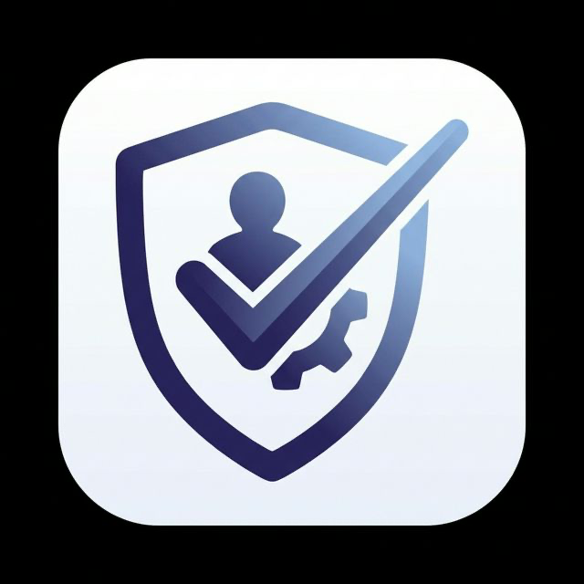

<div align="center">



# GoWorks

**Google Workspace™ yönetimi için açık kaynaklı masaüstü uygulaması — toplu kullanıcı yaşam döngüsü yönetimi, offboarding, Gmail imza dağıtımı ve grup yönetimi.**

[](LICENSE)
[]()
[]()
[]()
[]()

[English](README.md) · **Türkçe**

</div>

---

**GoWorks**, Google Workspace yöneticilerine, Google Admin Konsolu'nda yavaş ilerleyen günlük işler için hızlı ve odaklı bir arayüz sunan, çapraz platform bir masaüstü uygulamasıdır: çalışan onboarding ve offboarding süreçleri, CSV ile toplu hesap askıya alma veya silme, kuruma standart Gmail imzaları dağıtma, grup yönetimi ve kullanıcı etkinliği denetimi.

Uygulama **tamamen sizin makinenizde** çalışır — yerel bir SQLite veritabanı ve süreç içi bir iş kuyruğu ile. Barındırılacak bir sunucu, Docker ya da harici veritabanı yoktur. Uygulamayı kendi Google Cloud projenize bağlarsınız ve verileriniz bilgisayarınızdan asla dışarı çıkmaz.

## İçindekiler

- [Özellikler](#özellikler)
- [Neden GoWorks](#neden-goworks)
- [Ekran Görüntüleri](#ekran-görüntüleri)
- [Teknoloji Yığını](#teknoloji-yığını)
- [Başlangıç](#başlangıç)
- [Kurulum Dosyalarını Derleme](#kurulum-dosyalarını-derleme)
- [Mimari](#mimari)
- [OAuth İzin Kapsamları](#oauth-izin-kapsamları)
- [Güvenlik ve Gizlilik](#güvenlik-ve-gizlilik)
- [Katkıda Bulunma](#katkıda-bulunma)
- [Lisans](#lisans)
- [Yasal Uyarı](#yasal-uyarı)

## Özellikler

- **🔐 Güvenli Google OAuth2 girişi** — domain ve admin rolü doğrulamalı loopback OAuth akışı. Yalnızca yapılandırdığınız domaindeki Workspace yöneticileri giriş yapabilir.
- **👥 Kullanıcı yönetimi** — kullanıcı profillerini ve grup üyeliklerini arama, görüntüleme ve düzenleme; hesapları askıya alma, silme ve geri yükleme; alias ve e-posta yönlendirme yönetimi.
- **📦 Toplu işlemler** — CSV dosyasından suspend / delete / imza dağıtımı işlerini yürütme; rehberli sihirbaz, iptal edilebilir işler, hız sınırlama, geçici hatalarda otomatik yeniden deneme ve canlı ilerleme takibi.
- **🚪 Offboarding sihirbazı** — ayrılan bir çalışanı güvenle deprovizyon etmek için rehberli, çok adımlı akış: askıya alma, e-posta yönlendirme ayarlama, gruplardan çıkarma ve daha fazlası.
- **🧭 Onboarding sihirbazı** — ilk açılışta sizi firma markası, Google Cloud projesi, Service Account ve Domain-Wide Delegation adımlarında yönlendiren kurulum akışı.
- **✍️ Gmail imza yönetimi** — yeniden kullanılabilir token'lara sahip WYSIWYG HTML şablon editörü, medya yönetimi ve Service Account üzerinden domain genelinde arka planda imza dağıtımı.
- **🔎 İmza denetimi** — kurumdaki imza sapmalarını tarayın, ardından düzeltmeleri inceleyip uygulayın.
- **👨‍👩‍👧 Google Groups yönetimi** — gruplar, üyeler, roller, alias'lar ve erişim ayarları için tam CRUD (Directory API + Groups Settings API).
- **📊 Panel ve raporlar** — aktif iş takibi, Google Admin denetim günlüğü ve Workspace depolama/kullanım raporları.
- **🗂️ Kalıcı yerel depo** — şablonlar, unvanlar, kurumlar, uygulama yapılandırması ve tüm iş geçmişi yerel bir SQLite veritabanında; çökme sonrası işler kaldığı yerden devam eder.
- **🎨 Dinamik marka** — firma adı, sidebar kısaltması, logo, e-posta gönderici adı ve izin verilen giriş domaini uygulama içinden yapılandırılır. GoWorks **tek bir kuruma bağlı değildir** — yeniden markalama bir ayar değişikliğidir.
- **🌍 İki dilli arayüz** — tam Türkçe ve İngilizce arayüz, çalışma anında değiştirilebilir.

## Neden GoWorks

Google Admin Konsolu güçlüdür ama tekrarlayan yaşam döngüsü işleri için yavaştır — iyi bir toplu CSV akışı, imza şablonlama yok ve offboarding elle takip edilen bir kontrol listesidir. GoWorks, bu işleri her hafta yapan BT yöneticileri ve Workspace operatörleri için tasarlandı:

- **Altyapı yok** — indirin, Google Cloud projenizi bağlayın, hazır. Sunucu yok, veritabanı kurulumu yok.
- **Kendi kimlik bilgileriniz** — OAuth istemcisini *kendi* Google Cloud projenizde siz oluşturursunuz. Token'larınız ve verileriniz yerelde kalır.
- **Tasarımı gereği çok kiracılı** — hiçbir müşteriye özel bilgi koda gömülü değildir; tek bir derleme her kurum için çalışır.
- **Açık kaynak** — Apache 2.0 lisanslı. İnceleyin, fork'layın, uyarlayın.

## Ekran Görüntüleri

<!-- YAPILACAK: buraya Panel, Toplu İşlemler ve İmza editörünün ekran görüntüleri veya kısa bir GIF ekleyin -->
_Ekran görüntüleri yakında._

## Teknoloji Yığını

| Katman | Teknoloji |
|---|---|
| Masaüstü kabuğu | Electron 40 |
| Arayüz | React 18, Vite 5, TailwindCSS 4, Framer Motion, Lucide |
| Dil | TypeScript (strict) |
| Yerel veri | better-sqlite3 (SQLite), süreç içi iş kuyruğu |
| Google API'leri | googleapis, google-auth-library (OAuth2 + Service Account / DWD) |
| Dayanıklılık | Bottleneck (hız sınırlama), üstel geri çekilmeli yeniden deneme |
| Çoklu dil | i18next, react-i18next |
| Test | Vitest, Testing Library (jsdom) |

## Başlangıç

### Ön Gereksinimler

- **Node.js 18+** (20 önerilir)
- **Süper yönetici** yetkilerine sahip bir **Google Workspace** hesabı
- Kontrolünüzde olan bir **Google Cloud projesi**

### 1. Bir Google Cloud projesi hazırlayın

GoWorks kimlik bilgileriyle dağıtılmaz — her kurulum kendi Google Cloud OAuth istemcisini kullanır. Bu, verilerinizi izole tutar ve kendi API kotanızı kendinizin kontrol etmesini sağlar.

1. [Google Cloud Console](https://console.cloud.google.com/) üzerinde bir proje oluşturun.
2. Şu API'leri etkinleştirin: **Admin SDK API**, **Groups Settings API** ve **Gmail API**.
3. **OAuth onay ekranını** yapılandırın — **Internal (Dahili)** kullanıcı türünü seçin (tek bir kurum için önerilir; Google doğrulaması gerekmez).
4. Uygulama türü **Desktop app (Masaüstü uygulaması)** olan bir **OAuth istemci kimliği** oluşturun.
5. `.env.example` dosyasını `.env` olarak kopyalayıp istemci kimliğini ve gizli anahtarı doldurun:
   ```env
   GOOGLE_CLIENT_ID=your_client_id_here
   GOOGLE_CLIENT_SECRET=your_client_secret_here
   ```

### 2. Kurun ve çalıştırın

```bash
git clone https://github.com/umutcankurt/goworks.git
cd goworks
npm install
npm run dev
```

Onboarding sihirbazı ilk açılışta başlar ve gerisinde size yol gösterir.

### 3. (Opsiyonel) Gmail özellikleri için Service Account

Gmail imza dağıtımı ve iş tamamlanma e-postaları, **Domain-Wide Delegation (DWD)** yetkili bir **Service Account** gerektirir:

1. Google Cloud projenizde bir Service Account oluşturup JSON anahtarı üretin.
2. [Google Admin Konsolu](https://admin.google.com/) → **Güvenlik → API denetimleri → Etki alanı genelinde yetki devri** bölümünde, Service Account'un istemci kimliğini [DWD izin kapsamları](#oauth-izin-kapsamları) için yetkilendirin.
3. GoWorks'te **Ayarlar → Servis Hesabı** sekmesini açıp JSON anahtarını yükleyin. Anahtar `app.getPath('userData')/secrets/service-account.json` yolunda `0600` izinleriyle saklanır ve makinenizden asla çıkmaz.

## Kurulum Dosyalarını Derleme

```bash
npm run build
```

Platforma özel kurulum dosyalarını `release/{version}/` altında üretir — macOS `.dmg`, Windows `.exe` (NSIS) ve Linux `AppImage`. Otomatik güncelleme yoktur; yeni sürümler elle dağıtılır.

## Mimari

GoWorks, Electron'un standart iki süreçli yapısını kullanır:

- **Renderer** (`src/`) — React uygulaması. Google API'lerine asla doğrudan dokunmaz.
- **Main** (`electron/`) — Node.js süreci: OAuth, tüm Google API çağrıları, SQLite veritabanı ve iş kuyruğu.
- **Köprü** (`electron/preload.ts`) — güvenli IPC kanallarını açan bir context bridge.

```
React (renderer) → window.electronAPI.invoke(kanal) → ipcMain.handle → servisler → Google API'leri
```

İş kuyruğu, süreç içi bir runner ile SQLite tabanlıdır: iş türüne göre eşzamanlılık sınırları, iptal, `429 / 503 / ECONNRESET` hatalarında üstel geri çekilmeli yeniden deneme ve açılışta `RUNNING` durumdaki işlerin çökme sonrası kaldığı yerden devam etmesi.

Daha derin bir mimari referansı için [`CLAUDE.md`](CLAUDE.md) dosyasına bakın.

## OAuth İzin Kapsamları

**Etkileşimli yönetici girişi** (sizin OAuth istemciniz):

| Kapsam | Amaç |
|---|---|
| `userinfo.profile`, `userinfo.email` | Giriş yapan yöneticiyi tanımlama |
| `admin.directory.user` | Kullanıcıları okuma ve yönetme |
| `admin.directory.group` | Grupları okuma ve yönetme |
| `admin.directory.orgunit.readonly` | Organizasyon birimlerini okuma |
| `admin.directory.domain.readonly` | Domainleri okuma |
| `admin.reports.audit.readonly` | Admin denetim günlüğü |
| `admin.reports.usage.readonly` | Depolama ve kullanım raporları |
| `apps.groups.settings` | Grup erişim ayarları |

**Service Account (DWD)** — yalnızca Gmail özellikleri için gereklidir:

| Kapsam | Amaç |
|---|---|
| `admin.directory.user` | İmza dağıtımı için kullanıcıları çözümleme |
| `admin.directory.group.readonly` | Grup üyeliğini çözümleme |
| `admin.directory.orgunit.readonly` | Organizasyon birimlerini çözümleme |
| `gmail.settings.basic` | Gmail imzalarını ayarlama |
| `gmail.send` | İş tamamlanma bildirim e-postalarını gönderme |

## Güvenlik ve Gizlilik

- **Kimlik bilgileri sizin, proje sizin** — GoWorks hiçbir API anahtarı içermez. OAuth istemcisini siz oluşturursunuz; token'lar işletim sisteminizin kullanıcı verisi klasöründe yerel olarak saklanır.
- **Yalnızca yönetici** — hesap, yapılandırdığınız domainde bir Workspace yöneticisi değilse giriş reddedilir.
- **Yalnızca yerel veri** — SQLite veritabanı, OAuth token'ları ve Service Account anahtarı makinenizden asla çıkmaz. Telemetri yoktur ve GoWorks'ün bir arka uç sunucusu yoktur.
- **Boşta otomatik çıkış** — oturum, 2 saat hareketsizlikten sonra sona erer.
- `.env` veya `service-account.json` dosyalarınızı asla commit etmeyin — ikisi de varsayılan olarak git tarafından yok sayılır.

## Katkıda Bulunma

Katkılar, sorun bildirimleri ve özellik istekleri memnuniyetle karşılanır. Bir pull request açmadan önce lütfen yerel kontrollerin geçtiğinden emin olun:

```bash
npm run lint      # ESLint, sıfır uyarı
npx tsc --noEmit  # TypeScript strict
npm run test      # Vitest
```

GoWorks işinize yarıyorsa, depoya verilen bir ⭐ başkalarının da onu bulmasına yardımcı olur.

## Lisans

[Apache License 2.0](LICENSE) altında lisanslanmıştır. Ticari kullanım dahil olmak üzere kullanmakta, değiştirmekte ve dağıtmakta özgürsünüz.

## Yasal Uyarı

GoWorks bağımsız bir açık kaynak projesidir. Google LLC ile **bağlantılı değildir, Google tarafından onaylanmamış veya desteklenmemektedir**. "Google Workspace", "Google" ve "Gmail" Google LLC'nin ticari markalarıdır. GoWorks üzerinden Google API'lerinin kullanımı [Google API'leri Hizmet Şartları'na](https://developers.google.com/terms) tabidir.
