<div align="center">


# GoWorks

**Google Workspace™ yönetimi için açık kaynaklı masaüstü uygulaması — toplu kullanıcı yaşam döngüsü yönetimi, offboarding, Gmail imza dağıtımı ve grup yönetimi.**

[](LICENSE)
[]()
[]()
[]()
[]()

[English](README.md) · **Türkçe**

</div>

---

**GoWorks**, Google Workspace yöneticilerine, Google Admin Konsolu'nda yavaş ilerleyen günlük işler için hızlı ve odaklı bir arayüz sunan, çapraz platform bir masaüstü uygulamasıdır: çalışan onboarding ve offboarding süreçleri, CSV ile toplu hesap askıya alma veya silme, kuruma standart Gmail imzaları dağıtma, grup yönetimi ve kullanıcı etkinliği denetimi.

Uygulama **tamamen sizin makinenizde** çalışır — yerel bir SQLite veritabanı ve süreç içi bir iş kuyruğu ile. Barındırılacak bir sunucu, Docker ya da harici veritabanı yoktur. Uygulamayı kendi Google Cloud projenize bağlarsınız ve verileriniz bilgisayarınızdan asla dışarı çıkmaz.

## İçindekiler

- [Özellikler](#özellikler)
- [Neden GoWorks](#neden-goworks)
- [Ekran Görüntüleri](#ekran-görüntüleri)
- [Teknoloji Yığını](#teknoloji-yığını)
- [Başlangıç](#başlangıç)
- [Kurulum Dosyalarını Derleme](#kurulum-dosyalarını-derleme)
- [Sürüm Geçmişi](#sürüm-geçmişi)
- [Mimari](#mimari)
- [OAuth İzin Kapsamları](#oauth-izin-kapsamları)
- [Güvenlik ve Gizlilik](#güvenlik-ve-gizlilik)
- [Katkıda Bulunma](#katkıda-bulunma)
- [Lisans](#lisans)
- [Yasal Uyarı](#yasal-uyarı)
- [Yapay Zekâ Destekli Geliştirme](#yapay-zekâ-destekli-geliştirme)

## Özellikler

- **🔐 Güvenli Google OAuth2 girişi** — domain ve admin rolü doğrulamalı loopback OAuth akışı. Yalnızca yapılandırdığınız domaindeki Workspace yöneticileri giriş yapabilir.
- **🔒 Ana parola kasası (vault)** — hassas sırlar (Service Account anahtarı ve Google oturum/refresh token'ı) Argon2id + AES-256-GCM ile şifreli saklanır ve onboarding'de belirlediğiniz bir ana parolayla açılır. Yapılandırılabilir boşta otomatik kilit, uygulama içi parola değiştirme (yeniden yükleme veya giriş gerektirmez), çalışan işlerin bitmesine izin veren nazik (graceful) kilit ve üstel geri çekilmeli kaba kuvvet kilidi.
- **👥 Kullanıcı yönetimi** — kullanıcı profillerini ve grup üyeliklerini arama, görüntüleme ve düzenleme; hesapları askıya alma, silme ve geri yükleme; alias ve e-posta yönlendirme yönetimi.
- **📦 Toplu işlemler** — CSV dosyasından suspend / delete / imza dağıtımı / gruba üye ekleme işlerini yürütme; rehberli sihirbaz, iptal edilebilir işler, hız sınırlama, geçici hatalarda otomatik yeniden deneme ve canlı ilerleme takibi.
- **🚪 Offboarding sihirbazı** — ayrılan bir çalışanı güvenle deprovizyon etmek için rehberli, çok adımlı akış: askıya alma, e-posta yönlendirme ayarlama, gruplardan çıkarma ve daha fazlası.
- **🧭 Onboarding sihirbazı** — ilk açılışta sizi kullanım koşulları onayı, firma markası, Google Cloud projesi, Service Account ve Domain-Wide Delegation adımlarında yönlendiren kurulum akışı.
- **🧹 Fabrika ayarlarına sıfırlama** — tüm verileri (marka, OAuth kimlik bilgileri, Service Account, imzalar, geçmiş) yazarak-onayla korumasının ardından **güvenli biçimde** silip sıfırdan başlama: kasa dosyası silinmeden önce üzerine yazılır ve veritabanının boş sayfaları / WAL'ı geri kazanılır, böylece geride hassas hiçbir şey kalmaz. Ayrıca yapılandırmanızı koruyan daha hafif bir sihirbaz yeniden başlatma seçeneği de vardır.
- **✍️ Gmail imza yönetimi** — yeniden kullanılabilir token'lara sahip WYSIWYG HTML şablon editörü, biçimlendirme araç çubuğu, başlangıç şablonları, otomatik medya token'larıyla (`{{image_N}}`) doğrudan görsel yükleme ve Service Account üzerinden domain genelinde arka planda imza dağıtımı.
- **🔎 İmza denetimi** — kurumdaki imza sapmalarını tarayın, ardından düzeltmeleri inceleyip uygulayın.
- **👨‍👩‍👧 Google Groups yönetimi** — gruplar, üyeler, roller, alias'lar ve erişim ayarları için tam CRUD (Directory API + Groups Settings API); ayrıca CSV dosyasından toplu üye içe aktarma.
- **📊 Panel ve raporlar** — aktif iş takibi, Google Admin denetim günlüğü ve Workspace depolama/kullanım raporları.
- **🗂️ Kalıcı yerel depo** — şablonlar, unvanlar, kurumlar, uygulama yapılandırması ve tüm iş geçmişi yerel bir SQLite veritabanında; çökme sonrası işler kaldığı yerden devam eder.
- **🎨 Dinamik marka** — firma adı, sidebar kısaltması, logo, e-posta gönderici adı ve izin verilen giriş domaini uygulama içinden yapılandırılır. GoWorks **tek bir kuruma bağlı değildir** — yeniden markalama bir ayar değişikliğidir.
- **⚖️ Kullanım koşulları ve sorumluluk reddi** — onboarding sırasında gösterilen, koşullar değiştiğinde yeniden sorulan, sürümlenmiş ve dile duyarlı bir kullanım koşulları/sorumluluk reddi onay ekranı; Ayarlar → Hakkında'dan da görüntülenebilir.
- **🌍 İki dilli arayüz** — tam Türkçe ve İngilizce arayüz, çalışma anında değiştirilebilir.

## Neden GoWorks

Google Admin Konsolu güçlüdür ama tekrarlayan yaşam döngüsü işleri için yavaştır — iyi bir toplu CSV akışı, imza şablonlama yok ve offboarding elle takip edilen bir kontrol listesidir. GoWorks, bu işleri her hafta yapan BT yöneticileri ve Workspace operatörleri için tasarlandı:

- **Altyapı yok** — indirin, Google Cloud projenizi bağlayın, hazır. Sunucu yok, veritabanı kurulumu yok.
- **Kendi kimlik bilgileriniz** — OAuth istemcisini *kendi* Google Cloud projenizde siz oluşturursunuz. Token'larınız ve verileriniz yerelde kalır.
- **Tasarımı gereği çok kiracılı** — hiçbir müşteriye özel bilgi koda gömülü değildir; tek bir derleme her kurum için çalışır.
- **Açık kaynak** — Apache 2.0 lisanslı. İnceleyin, fork'layın, uyarlayın.

## Ekran Görüntüleri

> Uygulamanın yerleşik demo modunda, kurgusal bir kurum (**ABC Şirketi**) üzerinde
> alındı — gerçek müşteri verisi içermez. Bkz. [`docs/DEMO_MODE.md`](docs/DEMO_MODE.md).

| | |
|---|---|
| 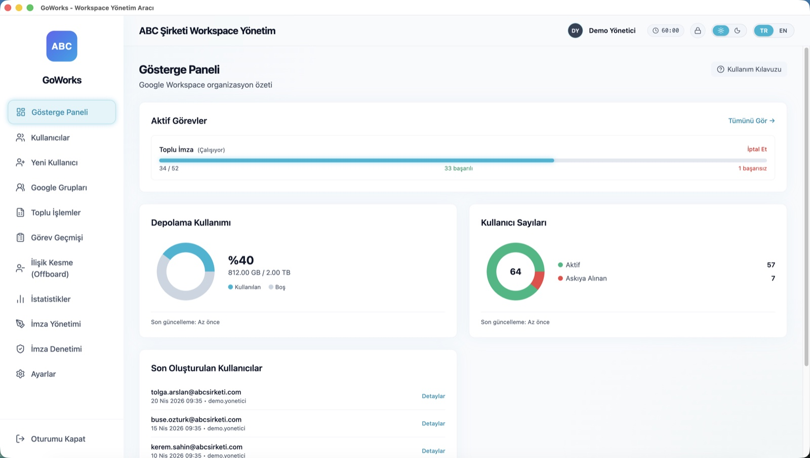 | 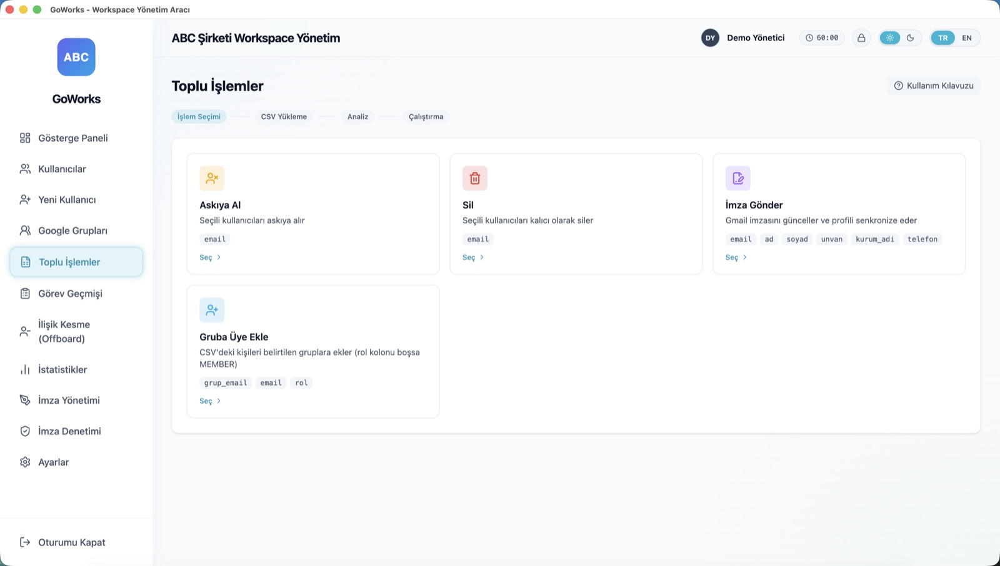 |
| **Gösterge Paneli** — depolama kullanımı, kullanıcı sayıları ve canlı ilerleme bildiren toplu iş | **Toplu İşlemler** — askıya alma, silme, imza gönderme veya gruba ekleme işini CSV yürütür |
| 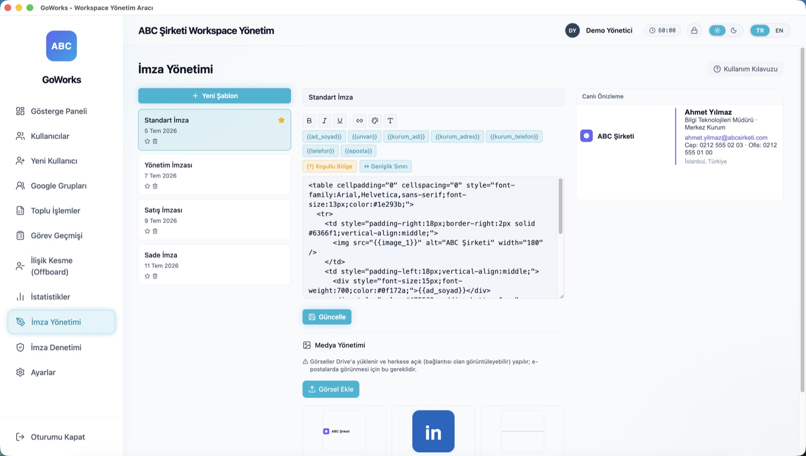 | 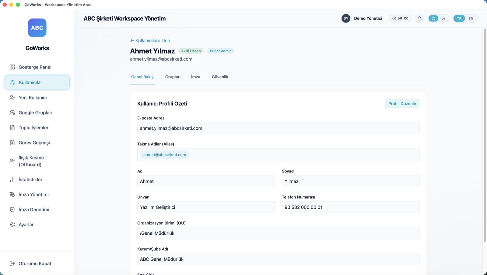 |
| **Gmail imza editörü** — yeniden kullanılabilir token'lar, biçimlendirme araç çubuğu, canlı önizleme ve görsel kütüphanesi | **Kullanıcı detayı** — profil, alias'lar, organizasyon birimi ve son giriş |
| 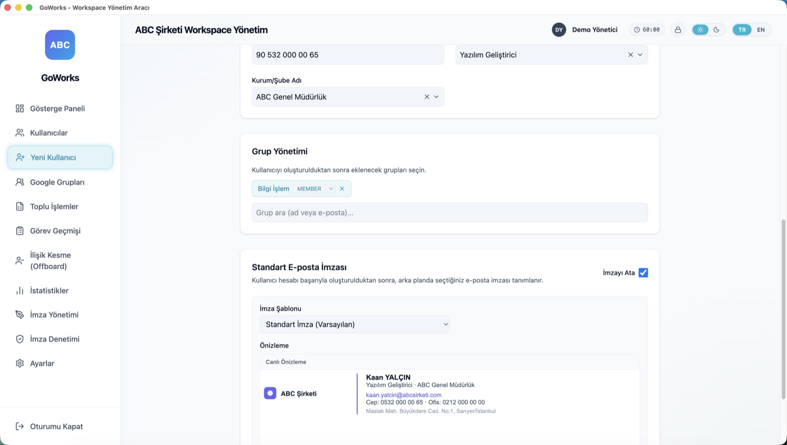 | 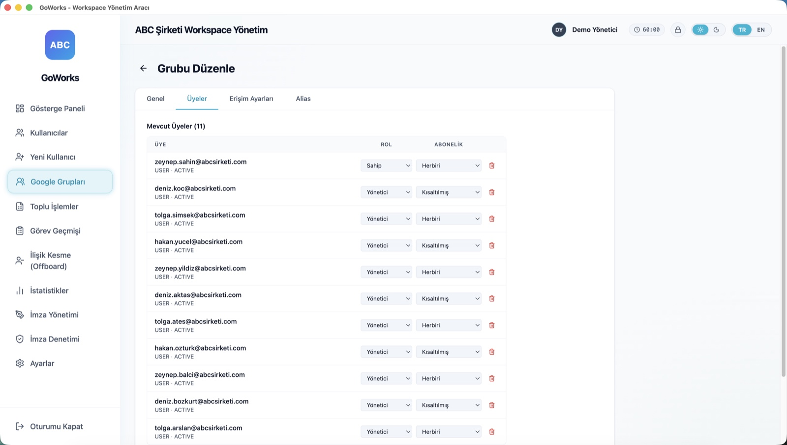 |
| **Yeni kullanıcı** — hesap oluşturulurken grup ve Gmail imzası atayın | **Grup düzenleme** — üye bazında rol ve abonelik, ayrıca erişim ayarları ve alias'lar |
| 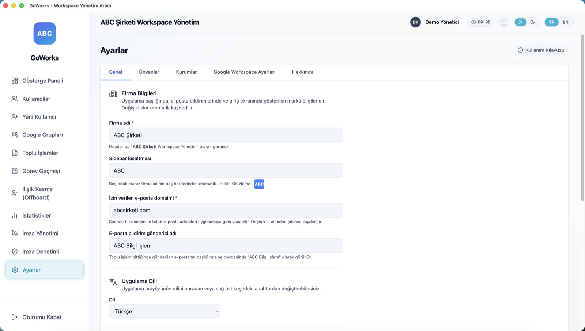 | 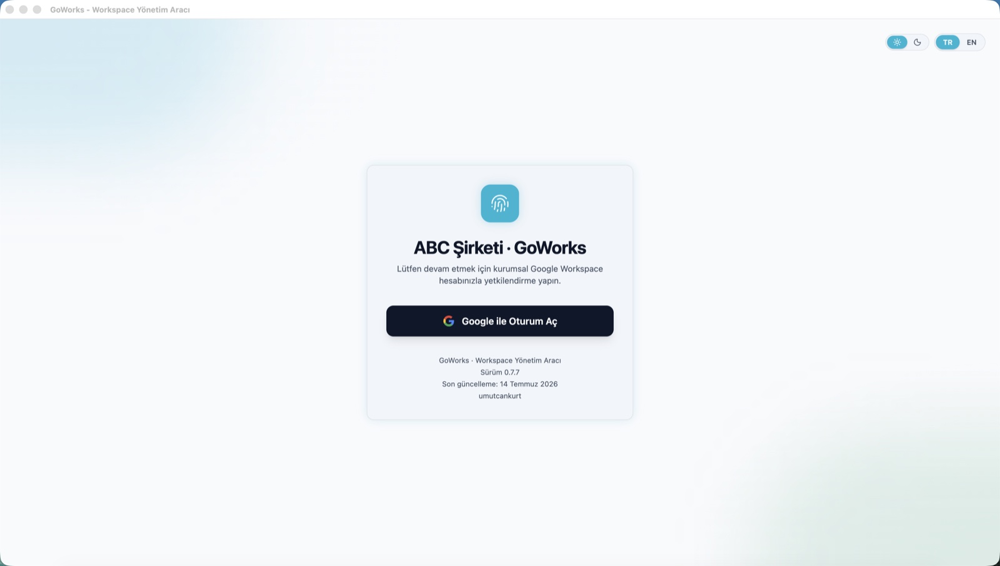 |
| **Ayarlar** — firma adı, logo, izin verilen domain ve dil; hepsi uygulama içinden | **Giriş** — Google ile oturum açma; yalnızca yapılandırdığınız domaindeki yöneticilere açık |

<details>
<summary><b>Diğer ekranlar</b> — kurulum sihirbazı, kasa kilidi, imza gönderme</summary>
<br>

**Onboarding sihirbazı** — kullanım koşulları onayından Google Cloud projesine, Service Account'tan Domain-Wide Delegation'a kadar dokuz rehberli adım.

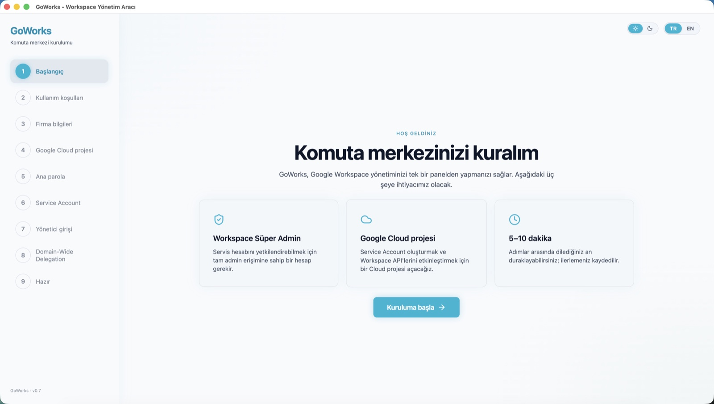
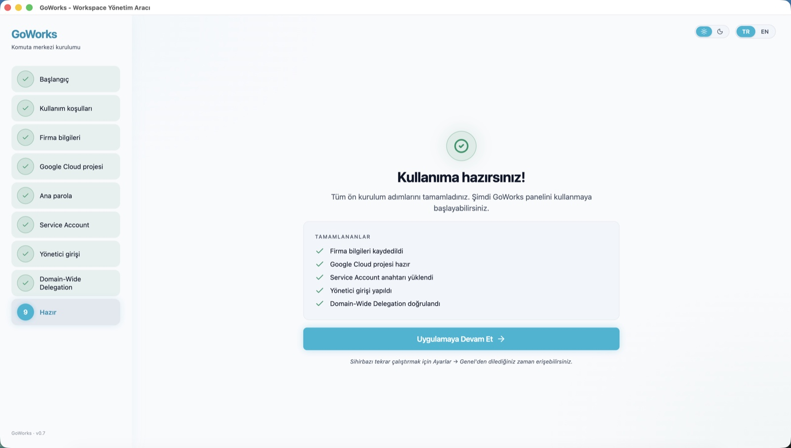

**Ana parola kasası** — boşta kalma süresi dolunca uygulama kilitlenir; kilidi açmak Google oturumunu yeniden giriş yapmadan geri getirir.

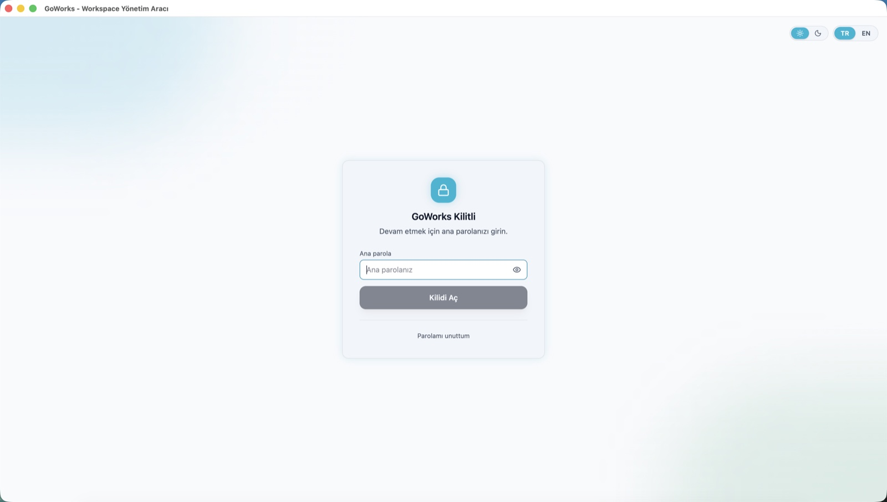

**İmza gönderme** — tek bir kullanıcının Gmail imzasına şablon uygulayın.

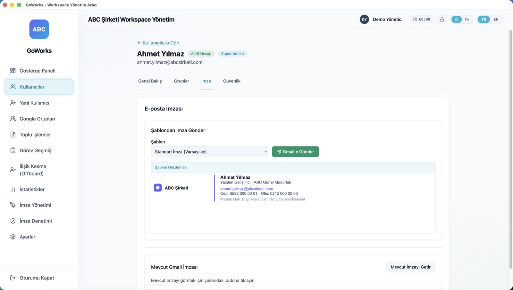

</details>

## Teknoloji Yığını

| Katman | Teknoloji |
|---|---|
| Masaüstü kabuğu | Electron 40 |
| Arayüz | React 18, Vite 5, TailwindCSS 4, Framer Motion, Lucide |
| Dil | TypeScript (strict) |
| Yerel veri | better-sqlite3 (SQLite), süreç içi iş kuyruğu |
| Google API'leri | googleapis, google-auth-library (OAuth2 + Service Account / DWD) |
| Dayanıklılık | Bottleneck (hız sınırlama), üstel geri çekilmeli yeniden deneme |
| Çoklu dil | i18next, react-i18next |
| Test | Vitest, Testing Library (jsdom) |

## Başlangıç

### Ön Gereksinimler

- **Node.js 20+**
- **Süper yönetici** yetkilerine sahip bir **Google Workspace** hesabı
- Kontrolünüzde olan bir **Google Cloud projesi**

### 1. Bir Google Cloud projesi hazırlayın

GoWorks kimlik bilgileriyle dağıtılmaz — her kurulum kendi Google Cloud OAuth istemcisini kullanır. Bu, verilerinizi izole tutar ve kendi API kotanızı kendinizin kontrol etmesini sağlar.

1. [Google Cloud Console](https://console.cloud.google.com/) üzerinde bir proje oluşturun.
2. Şu API'leri etkinleştirin: **Admin SDK API**, **Gmail API**, **Groups Settings API** ve **Google Drive API** (sonuncusu imza görsellerini yüklemek için gereklidir).
3. **OAuth onay ekranını** yapılandırın — **Internal (Dahili)** kullanıcı türünü seçin (tek bir kurum için önerilir; Google doğrulaması gerekmez).
4. Uygulama türü **Desktop app (Masaüstü uygulaması)** olan bir **OAuth istemci kimliği** oluşturun. Client ID ve Secret'ı bir kenara not edin — onboarding sihirbazı ilk açılışta soracak.

   > **`.env` gerekmiyor.** OAuth Client ID/Secret onboarding sihirbazının "Google Cloud projesi" adımında toplanır ve cihazınızda yerel olarak SQLite `app_config` tablosunda düz yapılandırma olarak saklanır. Masaüstü uygulamasında client secret bir "public client" kimlik bilgisidir (RFC 8252), gerçek bir sır değildir — üstelik access token'ı yenilemek için ana parola kasası açılmadan ÖNCE okunabilir olması gerekir. Gerçekten hassas sırlar (Service Account anahtarı ve refresh token) bunun yerine kasada şifreli durur. OAuth değerlerini daha sonra Settings → Genel → "Google OAuth Bilgileri" kartından değiştirebilirsiniz.
   >
   > Yerel geliştirme için isterseniz değerleri `.env`'e koyabilirsiniz (`.env.example`'dan kopyalayın); ilk açılışta otomatik şifreli depoya migrate edilir. Production'da `.env` → `.env.migrated` olarak yeniden adlandırılır; geliştirme modunda dokunulmaz.

### 2. Kurun ve çalıştırın

```bash
git clone https://github.com/umutcankurt/goworks.git
cd goworks
npm install
npm run dev
```

Onboarding sihirbazı ilk açılışta başlar ve gerisinde size yol gösterir.

### 3. (Opsiyonel) Gmail özellikleri için Service Account

Gmail imza dağıtımı ve iş tamamlanma e-postaları, **Domain-Wide Delegation (DWD)** yetkili bir **Service Account** gerektirir:

1. Google Cloud projenizde bir Service Account oluşturup JSON anahtarı üretin.
2. [Google Admin Konsolu](https://admin.google.com/) → **Güvenlik → API denetimleri → Etki alanı genelinde yetki devri** bölümünde, Service Account'un istemci kimliğini [DWD izin kapsamları](#oauth-izin-kapsamları) için yetkilendirin.
3. GoWorks'te **Ayarlar → Servis Hesabı** sekmesini açıp JSON anahtarını yükleyin. Anahtar, ana parola kasasına (`vault.enc`) şifreli olarak yazılır ve makinenizden asla çıkmaz. (Anahtarı eskiden `…/secrets/` altında `0600` izinli bir dosyada tutan kurulumlar, ilk kilit açılışında kasaya taşınır ve düz metin dosya silinir.)

## Kurulum Dosyalarını Derleme

```bash
npm run build
```

Platforma özel kurulum dosyalarını `release/{version}/` altında üretir — macOS `.dmg` ve Windows `.exe` (NSIS). Otomatik güncelleme yoktur; yeni sürümler elle dağıtılır.

## Sorun Giderme

### `No handler registered for 'X'` (kurulum dosyası derleme sonrası rastgele IPC hataları)

`npm run build` çalıştırıp (hem `-m` hem `-w` çıktıları üretir) ardından dev makinenize geri döndüyseniz, `node_modules/` altındaki `better-sqlite3` native binary'si yanlış platform veya Electron ABI'sine derlenmiş olabilir. Belirti: renderer'da rastgele bir IPC çağrısı hata verir — `config:set`, `auth:check`, `config:getAll` vb.

Üç bağımsız savunma katmanı devrede:

1. **`npm run dev`** — `predev` hook'u ABI mismatch'i tespit ederse otomatik yeniden derleme tetikler. Geç açılışın nedenini bilmeniz için terminale dikkat çekici bir banner basılır (~30–60s sürer).
2. **Boot-check** — runtime'da hâlâ bir uyumsuzluk varsa uygulama açılırken hata diyaloğu çözüm komutunu gösterir ve çıkar.
3. **Manuel çözüm** — `npm run rebuild` (`electron-builder install-app-deps` için alias) istediğiniz zaman.

**CI / strict mod**: `CHECK_NATIVE_ABI_STRICT=1` (veya GitHub Actions ve birçok CI runner'ının otomatik atadığı `CI=true`) ile predev hook'u otomatik rebuild yerine sert şekilde hata verir.

Dev'i tetiklemeden binary'yi kontrol etmek için `npm run abi:check` tek başına çalıştırılabilir.

## Sürüm Geçmişi

Sürüm bazında değişiklik geçmişi için [`CHANGELOG.md`](CHANGELOG.md) dosyasına bakın.

## Mimari

GoWorks, Electron'un standart iki süreçli yapısını kullanır:

- **Renderer** (`src/`) — React uygulaması. Google API'lerine asla doğrudan dokunmaz.
- **Main** (`electron/`) — Node.js süreci: OAuth, tüm Google API çağrıları, SQLite veritabanı ve iş kuyruğu.
- **Köprü** (`electron/preload.ts`) — güvenli IPC kanallarını açan bir context bridge.

```
React (renderer) → window.electronAPI.invoke(kanal) → ipcMain.handle → servisler → Google API'leri
```

İş kuyruğu, süreç içi bir runner ile SQLite tabanlıdır: iş türüne göre eşzamanlılık sınırları, iptal, `429 / 503 / ECONNRESET` hatalarında üstel geri çekilmeli yeniden deneme ve açılışta `RUNNING` durumdaki işlerin çökme sonrası kaldığı yerden devam etmesi.

## OAuth İzin Kapsamları

**Etkileşimli yönetici girişi** (sizin OAuth istemciniz):

| Kapsam | Amaç |
|---|---|
| `userinfo.profile`, `userinfo.email` | Giriş yapan yöneticiyi tanımlama |
| `admin.directory.user` | Kullanıcıları okuma ve yönetme |
| `admin.directory.group` | Grupları okuma ve yönetme |
| `admin.directory.orgunit.readonly` | Organizasyon birimlerini okuma |
| `admin.directory.domain.readonly` | Domainleri okuma |
| `admin.reports.audit.readonly` | Admin denetim günlüğü |
| `admin.reports.usage.readonly` | Depolama ve kullanım raporları |
| `apps.groups.settings` | Grup erişim ayarları |
| `drive.file` | İmza görsellerini Drive'a yükleme (yalnızca uygulamanın oluşturduğu dosyalar) |

**Service Account (DWD)** — yalnızca Gmail özellikleri için gereklidir:

| Kapsam | Amaç |
|---|---|
| `admin.directory.user` | İmza dağıtımı için kullanıcıları çözümleme |
| `admin.directory.group.readonly` | Grup üyeliğini çözümleme |
| `admin.directory.orgunit.readonly` | Organizasyon birimlerini çözümleme |
| `gmail.settings.basic` | Gmail imzalarını ayarlama |
| `gmail.send` | İş tamamlanma bildirim e-postalarını gönderme |

## Güvenlik ve Gizlilik

- **Kimlik bilgileri sizin, proje sizin** — GoWorks hiçbir API anahtarı içermez. OAuth istemcisini siz oluşturursunuz; her şey işletim sisteminizin kullanıcı verisi klasöründe yerel olarak saklanır.
- **Yalnızca yönetici** — hesap, yapılandırdığınız domainde bir Workspace yöneticisi değilse giriş reddedilir.
- **Ana parola kasası** — gerçekten hassas sırlar (Service Account anahtarı ve Google refresh token'ı) bir ana parola kasasında (`vault.enc`, Argon2id + AES-256-GCM) şifreli durur ve makinenizden asla çıkmaz. Access token yalnızca bellekte tutulur; OAuth Client ID/Secret ise düz yapılandırma olarak saklanır (masaüstü uygulaması "public client"tır — secret gerçek bir sır değildir). Electron `safeStorage` emekliye ayrıldı ve yalnızca eski kurulumları taşımak için bir kez okunur.
- **Yalnızca yerel veri** — SQLite veritabanı ve tüm sırlar makinenizde kalır. Telemetri yoktur ve GoWorks'ün bir arka uç sunucusu yoktur.
- **Veri konumu ve elden çıkarma** — her şey işletim sisteminizin kullanıcı verisi klasöründe durur (Windows'ta `%APPDATA%\GoWorks`, macOS'ta `~/Library/Application Support/GoWorks`): `vault.enc` (şifreli Service Account anahtarı ve refresh token), `goworks.db` (marka, kurumlar, şablonlar ve düz yapılandırma OAuth client secret) ve `logs/` (e-posta adresleri içerebilir). Bir makineyi elden çıkarırken bu veriyi bilinçli olarak silin: **Windows'ta** uninstaller silmeyi teklif eder (opt-in; varsayılan korumaktır), **macOS'ta** ise uninstall hook'u olmadığından önce **Ayarlar → Fabrika Ayarlarına Sıfırlama** çalıştırın. Fabrika sıfırlaması güvenli bir silme yapar (`vault.enc` üzerine yazıp siler, veritabanında `VACUUM` + `wal_checkpoint(TRUNCATE)` uygular ve logları kaldırır).
- **Boşta otomatik kilit** — yapılandırılabilir bir boşta süresinden sonra (varsayılan 1 saat; Ayarlar → Genel → Güvenlik'ten ayarlanır, `0` = kapalı) kasa, çıkış yapmak yerine **kilitlenir**: bellekteki kimlik bilgileri düşürülür ama refresh token kasada yaşamaya devam eder, böylece ana parolayla kilit açıldığında Google oturumu sessizce geri yüklenir. Saklanan oturum artık yenilenemiyorsa (örneğin refresh token iptal edildiyse), sessizce hata vermek yerine özel bir yeniden kimlik doğrulama ekranı sizi tekrar girişe yönlendirir.
- **Ana parolayı unutmak geri alınamaz** — tek yol kasayı sıfırlamaktır; bu, saklanan Service Account anahtarını ve oturumu siler. Ardından anahtarı yeniden yükler ve Google'a yeniden giriş yaparsınız.
- `.env` dosyanızı asla commit etmeyin — varsayılan olarak git tarafından yok sayılır.

Bir güvenlik açığı mı buldunuz? Lütfen özel olarak bildirin — bkz. [`SECURITY.md`](SECURITY.md).

## Katkıda Bulunma

Katkılar, sorun bildirimleri ve özellik istekleri memnuniyetle karşılanır. Geliştirme kurulumu ve kurallar için [`CONTRIBUTING.md`](CONTRIBUTING.md) dosyasına bakın. Bir pull request açmadan önce lütfen yerel kontrollerin geçtiğinden emin olun:

```bash
npm run lint      # ESLint, sıfır uyarı
npx tsc --noEmit  # TypeScript strict
npm run test      # Vitest
```

GoWorks işinize yarıyorsa, depoya verilen bir ⭐ başkalarının da onu bulmasına yardımcı olur.

## Lisans

[Apache License 2.0](LICENSE) altında lisanslanmıştır. Ticari kullanım dahil olmak üzere kullanmakta, değiştirmekte ve dağıtmakta özgürsünüz.

## Yasal Uyarı

GoWorks bağımsız bir açık kaynak projesidir. Google LLC ile **bağlantılı değildir, Google tarafından onaylanmamış veya desteklenmemektedir**. "Google Workspace", "Google" ve "Gmail" Google LLC'nin ticari markalarıdır. GoWorks üzerinden Google API'lerinin kullanımı [Google API'leri Hizmet Şartları'na](https://developers.google.com/terms) tabidir.

## Yapay Zekâ Destekli Geliştirme

Bu proje, başta Anthropic'in Claude'u olmak üzere çeşitli yapay zekâ araçları kullanılarak üretilmiştir. Kod, dokümantasyon ve testler birleştirilmeden önce gözden geçirildi; ancak hiçbir otomatik asistan yanılmaz değildir.

GoWorks, Google Workspace kiracınız üzerinde yönetici yetkileriyle işlem yapar ve bazı operasyonları (askıya alma, silme, toplu değişiklikler) geri alınamaz. **Üretim ortamındaki bir kiracıya yöneltmeden önce kendi kontrollerinizi ve testlerinizi yapmayı unutmayın.**
